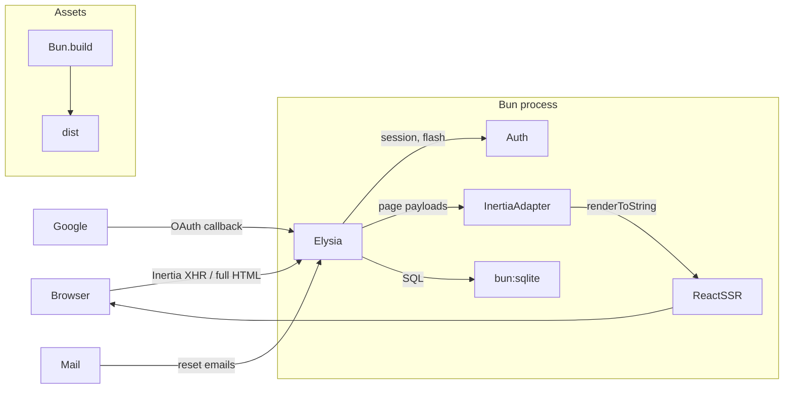

# Elysia + Inertia v3 Boilerplate

A production-shaped, full-stack boilerplate: **Elysia** (HTTP) + **bun:sqlite**
(database) + **Inertia v3 / React 19** (server-driven UI with in-process SSR),
running entirely on **Bun**. Auth (register / login / dashboard / logout /
forgot-password / Google OAuth), roles, rate limiting, tests, and Docker are
wired end to end.



## Quick start

```bash
bun install
cp .env.example .env
bun run dev          # http://localhost:3000
bun test             # 20-test E2E suite against an in-memory DB
bun run db:seed      # demo user: demo@example.com / password123 (role: user)
bun run db:seed admin@example.com admin123 admin   # role: admin
```

### Scripts

| Command             | What it does                                              |
| ------------------- | --------------------------------------------------------- |
| `bun run dev`       | Watch mode; rebuilds client assets on restart             |
| `bun run build`     | Prebuild client assets → `dist/` (+ `manifest.json`)      |
| `bun run start`     | Serve prebuilt assets (`NODE_ENV=production`)             |
| `bun test`          | E2E suite (auth, roles, reset flow, Inertia protocol)     |
| `bun run db:seed`   | Create a demo user (`[email] [password] [role]` args)     |
| `bun run typecheck` | `tsc --noEmit`                                            |

## Features

- **Auth**: register, login, logout — argon2id passwords, DB-backed sessions
  (httpOnly `SameSite=Lax` cookies, 30-day expiry), CSRF (Origin check).
- **Forgot / reset password** with email delivery (see Mail below) and
  hashed reset tokens (60-minute expiry).
- **Google OAuth** register-or-login (zero-dep, plain fetch; button hidden
  when not configured).
- **Roles**: `user` / `admin`, `requireRole('admin')` guard, `/admin` page
  with paginated user list.
- **Rate limiting** on auth endpoints (in-memory fixed window, per IP).
- **Inertia v3**: full SSR on first load, SPA navigation after, asset-version
  negotiation (409 + reload), partial reloads, flash messages, shared props.
- **Migrations**: versioned SQL files applied at startup in transactions.
- **Ops**: request logging with correlation id, security headers (CSP,
  nosniff, frame denial), `/health`, graceful shutdown, Docker.
- **Testing**: `bun test` — boots the app against an in-memory SQLite DB.

## Configuration (.env)

| Variable | Default | Notes |
| --- | --- | --- |
| `PORT` | `3000` | |
| `APP_URL` | `http://localhost:3000` | Absolute base URL (email links, OAuth redirects) |
| `DATABASE_PATH` | `./data/app.sqlite` | |
| `MAIL_DRIVER` | `log` | `log` \| `resend` \| `mailtrap` |
| `MAIL_FROM` | `no-reply@example.com` | |
| `RESEND_API_KEY` | — | required when `MAIL_DRIVER=resend` |
| `MAILTRAP_API_TOKEN` | — | required when `MAIL_DRIVER=mailtrap` |
| `MAILTRAP_INBOX_ID` | — | use the sandbox endpoint when set |
| `GOOGLE_CLIENT_ID` / `GOOGLE_CLIENT_SECRET` | — | enable Google OAuth (both or none) |
| `RATE_LIMIT_AUTH_MAX` / `RATE_LIMIT_AUTH_WINDOW` | `10` / `60` | requests per window on auth endpoints |

Invalid/incomplete config fails fast at startup with a clear message
(`src/server/config.ts`).

### Google OAuth setup

1. [Google Cloud Console](https://console.cloud.google.com/apis/credentials) →
   create OAuth client (Web application).
2. Authorized redirect URI: `https://<your-domain>/auth/google/callback`
   (`http://localhost:3000/auth/google/callback` for local dev).
3. Set `GOOGLE_CLIENT_ID` and `GOOGLE_CLIENT_SECRET` in `.env`.

### Mail drivers

- **log** (default): prints a formatted message and records it in
  `sentMails` — usable in dev and asserted in tests.
- **resend**: set `RESEND_API_KEY` (`MAIL_DRIVER=resend`).
- **mailtrap**: set `MAILTRAP_API_TOKEN` (`MAIL_DRIVER=mailtrap`); add
  `MAILTRAP_INBOX_ID` to use the sandbox endpoint.

## Architecture

```
src/
├── index.ts                # entry: build assets (dev), listen, graceful shutdown
├── server/
│   ├── app.ts              # composition: logging, CSRF, onError, routes
│   ├── config.ts           # validated env config (fails fast)
│   ├── db.ts               # bun:sqlite: connection, prepared statements
│   ├── migrations.ts       # SQL migration runner
│   ├── auth.ts             # argon2id, sessions, flash, cookies, reset tokens, guards
│   ├── inertia.ts          # Inertia v3 server adapter (SSR shell, XHR, 409)
│   ├── inertia-plugin.ts   # store declarations + per-request session resolve
│   ├── mailer.ts           # mail drivers: log / resend / mailtrap
│   ├── rate-limit.ts       # in-memory fixed-window rate limiter
│   ├── logger.ts           # request logging + x-request-id
│   ├── security.ts         # CSRF origin check + security headers
│   ├── assets.ts           # Bun.build pipeline + manifest + static serving
│   └── routes/
│       ├── auth.routes.ts  # register/login/logout/forgot/reset + schemas
│       ├── oauth.routes.ts # Google OAuth
│       └── pages.routes.ts # GET pages incl. /admin (paginated)
├── client/
│   ├── app.tsx             # Inertia client bootstrap (hydrate or render)
│   ├── ssr.tsx             # in-process SSR renderer (react-dom/server)
│   ├── pages.ts            # explicit page registry (shared by SSR + bundle)
│   ├── pages/              # Login, Register, Dashboard, ForgotPassword,
│   │                       # ResetPassword, Admin, NotFound
│   ├── components/         # Layout, AuthLayout, Field
│   └── styles.css          # plain CSS, light/dark
├── shared/
│   ├── types.ts            # User, Role, FlashData, SharedPageProps, Paginated
│   └── inertia.d.ts        # InertiaConfig augmentation → typed props.auth
├── migrations/             # versioned SQL schema files (0001, 0002, …)
├── tests/                  # bun:test E2E suite (in-memory DB)
└── scripts/                # build.ts, seed.ts
```

## How the pieces fit

- **Request lifecycle**: `logBefore` (correlation id) → `checkOrigin` (CSRF)
  → route's session resolve + guards → handler → Inertia render (SSR HTML for
  browsers, JSON for `X-Inertia` XHR) → `onError` (422 validation with
  friendly field messages, 404 page, 500).
- **Auth**: argon2id via `Bun.password`; 256-bit random session tokens in
  SQLite; cookies httpOnly/`SameSite=Lax`/Secure-in-prod. Logout deletes the
  session row server-side. `passwordHash` never leaves the server.
- **Guards** are route `beforeHandle`s: `requireAuth`, `guestOnly`,
  `requireRole('admin')` (non-admins redirect to `/dashboard`).
- **Rate limiting** is an in-memory fixed-window limiter keyed by
  `X-Forwarded-For`/peer IP, applied to all auth endpoints. Swap the store
  for Redis behind the same hook signature when scaling horizontally.
- **Inertia v3 protocol** (`inertia.ts`): full HTML with SSR markup +
  `data-page` JSON for browser visits; JSON page payloads for XHR;
  `409 + X-Inertia-Location` on asset-version mismatch; partial reloads via
  `X-Inertia-Partial-*`; one-shot flash and shared props merged per page.
- **SSR + hydration**: `renderPage()` renders with
  `createInertiaApp({ page, render: renderToString })`; the client hydrates
  when `data-server-rendered` is present. Same page registry on both sides.
- **Asset versioning**: `Bun.build` emits content-hashed files; the hash is
  the Inertia `version`. Stale clients get a 409 and reload.
- **Validation**: TypeBox schemas at the route level; `onError` maps failures
  to 422 Inertia page payloads (`VALIDATION_MESSAGES` in
  `routes/auth.routes.ts`).

## Database migrations

Schema changes are plain SQL files in `migrations/`, applied automatically at
startup in filename order, each inside a transaction, recorded in
`schema_migrations` (never re-applied).

```bash
# add a column to an existing table
cat > migrations/0003_add_last_login.sql <<'SQL'
ALTER TABLE users ADD COLUMN last_login_at TEXT;
SQL
bun run dev   # migration runs on boot
```

Rules:
- **Never edit an applied migration** — add a new numbered file instead.
- SQLite `ALTER TABLE ADD COLUMN` with `NOT NULL` requires a `DEFAULT`.
- A failed migration rolls back and aborts startup.

## Testing

```bash
bun test
```

The suite boots the full app against an in-memory SQLite database and drives
it through `app.handle()`: registration/login/logout, guards and roles,
password reset end to end (via the log mail driver), Inertia protocol
(409/404/SSR), CSRF, and `/health`.

## Deployment

```bash
docker compose up -d --build
```

- Multi-stage `Dockerfile` (`oven/bun:1.3-alpine`): assets prebuilt in the
  build stage, production deps only at runtime.
- `./data` volume keeps the SQLite database across restarts; healthcheck hits
  `/health`.

Alternatives: `bun build --compile` for a single binary, or plain
`bun run start` behind your process supervisor (it handles SIGTERM
gracefully).

## Notes / decisions

- **Elysia 1.4 quirks handled**: hooks apply in registration order (global
  `onError` must precede routes); plugins without routes drop their hooks
  (session resolve is registered on the route-bearing instances); the
  rate-limit package for newer Elysia versions calls APIs missing in 1.4, so
  the limiter is hand-rolled instead.
- `import.meta.glob` was removed from Bun 1.3 — the page registry uses
  explicit imports.
- CSP uses `script-src 'unsafe-inline'` because Inertia embeds the page
  payload as inline JSON; external script injection is still blocked.
- `X-Forwarded-For` is trusted for rate limiting — only run behind a proxy
  that sets it.
- Want Vue/Svelte instead of React? Swap `@inertiajs/react` for the
  corresponding v3 adapter — the server side is adapter-agnostic.
