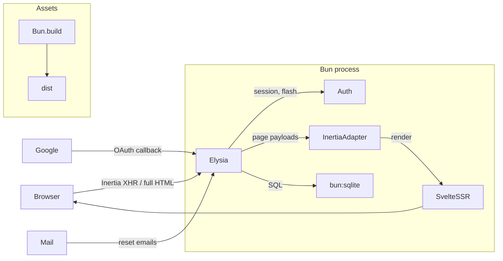

# Dulak

The Banjar word for *bored* — a deliberately boring full-stack starter.

[](https://github.com/maulanashalihin/dulak/actions/workflows/ci.yml)
[](LICENSE)
[](https://bun.sh)

A production-shaped, full-stack boilerplate: **Elysia** (HTTP) + **bun:sqlite**
(database) + **Inertia v3 / Svelte 5** (server-driven UI with in-process SSR),
running entirely on **Bun**. Auth (register / login / logout / forgot-password /
Google OAuth), roles, rate limiting, tus uploads, migrations, tests, and Docker
are wired end to end.



## Philosophy

**Dulak** is the Banjar word for *bored* — the name is the philosophy. Every
choice favors the next maintainer — human or AI agent — over cleverness:

- **Zero-dependency where it's cheap.** Tailwind CSS v4 (via `@tailwindcss/cli`,
  no PostCSS), a hand-rolled rate limiter and OAuth client instead of packages
  that pin the stack, raw `bun:sqlite` instead of an ORM. Dependencies are a
  liability; when a hand-rolled 60-line module does the job, it ships.
- **One obvious way to do things.** A single structural convention (codified
  in `AGENTS.md`): routes in `routes/<feature>.routes.ts` with handlers
  inline, shared logic as flat modules, all SQL in `db.ts`, schema in
  versioned migrations. No feature folders, no second way to do the same
  thing.
- **Discoverability as a contract.** Given any URL you can derive the file
  that owns it: `src/server/routes/` mirrors URL namespaces, every URL lives
  in exactly one file (GET renders + POST actions together), and new
  features get their own `<feature>.routes.ts`. Tests run deterministically
  (`bun test --isolate`). The repo is built to be extended safely by anyone.
- **Production-shaped, not production.** The guardrails a deployed app needs
  — migrations, CSRF, rate limiting, security headers, session rotation,
  graceful shutdown, CI, Docker — are wired from day one, so you start with a
  skeleton that is *shaped* like a production app. But it is not one: the
  only pre-built feature is auth, and anything deployment-specific
  (Redis-backed rate limiting for horizontal scaling, CDN, observability) is
  a deliberate swap point. The product is yours to add by following the
  conventions.
- **Boring versions, current versions.** Elysia 1.4 (2.x is beta and changes
  hook APIs), Bun 1.3. Upgrades are deliberate decisions, not defaults.
- **Correctness over cleverness.** Synchronous, explicitly typed,
  parameterized queries, fail-fast config, documented decisions (see
  "Notes / decisions" below). If a piece can't be explained in one sentence,
  it doesn't belong in a starter.

## Quick start

```bash
# Scaffold a new project (downloads template, installs deps, creates .env)
bunx create-dulak my-app
cd my-app
bun run dev          # http://localhost:3000 (run dev:css in another terminal)

# Or clone manually:
bun install
cp .env.example .env
bun run dev:css      # Tailwind watch (separate terminal)
bun run dev          # http://localhost:3000
bun test --isolate   # 46-test E2E suite against an in-memory DB
bun run db:seed      # demo user: demo@example.com / password123 (role: user)
bun run db:seed admin@example.com admin123 admin   # role: admin
```

### Scripts

| Command             | What it does                                              |
| `bun run dev`       | Watch mode; rebuilds client assets on restart             |
| `bun run dev:css`   | Tailwind v4 watch mode (`@tailwindcss/cli --watch`)       |
| `bun run build`     | Prebuild client assets → `dist/` (+ `manifest.json`)      |
| `bun run start`     | Serve prebuilt assets (`NODE_ENV=production`)             |
| `bun run test`      | E2E suite (auth, roles, reset flow, Inertia protocol, tus) |
| `bun run db:seed`   | Create a demo user (`[email] [password] [role]` args)     |
| `bun run typecheck` | `svelte-check --tsconfig ./tsconfig.json`                 |

## Features

- **Auth**: register, login, logout — argon2id passwords, DB-backed sessions
  (httpOnly `SameSite=Lax` cookies, 30-day expiry), CSRF (Origin check).
- **Forgot / reset password** with email delivery (see Mail below) and
  hashed reset tokens (60-minute expiry).
- **Google OAuth** register-or-login (zero-dep, plain fetch; button hidden
  when not configured). The profile picture is downloaded and stored locally
  (the CSP blocks external images), so avatars always load from our origin.
- **Roles**: `user` / `admin`, `requireRole('admin')` guard, `/admin` page
  with paginated user list.
- **Rate limiting** on auth endpoints (in-memory fixed window, per IP).
- **Inertia v3**: full SSR on first load, SPA navigation after, asset-version
  negotiation (409 + reload), partial reloads, flash messages, shared props.
- **Resumable uploads**: tus protocol v1 at `/uploads` (creation,
  creation-with-upload, termination, expiration, checksum) with SQLite state
  and on-disk storage — demonstrated end to end by the avatar upload on the
  profile page.
- **Migrations**: versioned SQL files applied at startup in transactions.
- **Ops**: request logging with correlation id, security headers (CSP,
  nosniff, frame denial), `/health`, graceful shutdown, Docker.
- **Testing**: `bun test` — boots the app against an in-memory SQLite DB.

## Configuration (.env)

| Variable | Default | Notes |
| --- | --- | --- |
| `PORT` | `3000` | |
| `APP_URL` | `http://localhost:3000` | Absolute base URL (email links, OAuth redirects) |
| `DATABASE_PATH` | `./data/app.sqlite` | |
| `MAIL_DRIVER` | `log` | `log` \| `resend` \| `mailtrap` |
| `MAIL_FROM` | `no-reply@example.com` | |
| `RESEND_API_KEY` | — | required when `MAIL_DRIVER=resend` |
| `MAILTRAP_API_TOKEN` | — | required when `MAIL_DRIVER=mailtrap` |
| `MAILTRAP_INBOX_ID` | — | use the sandbox endpoint when set |
| `GOOGLE_CLIENT_ID` / `GOOGLE_CLIENT_SECRET` | — | enable Google OAuth (both or none) |
| `RATE_LIMIT_AUTH_MAX` / `RATE_LIMIT_AUTH_WINDOW` | `10` / `60` | requests per window on auth endpoints |
| `UPLOAD_DIR` | `./data/uploads` | tus upload bytes on disk |
| `TUS_MAX_SIZE` | `0` | max upload size in bytes (`0` = unlimited) |
| `TUS_EXPIRATION_SECONDS` | `0` | unfinished upload TTL in seconds (`0` = no expiry) |

Invalid/incomplete config fails fast at startup with a clear message
(`src/server/config.ts`).

### Google OAuth setup

1. [Google Cloud Console](https://console.cloud.google.com/apis/credentials) →
   create OAuth client (Web application).
2. Authorized redirect URI: `https://<your-domain>/auth/google/callback`
   (`http://localhost:3000/auth/google/callback` for local dev).
3. Set `GOOGLE_CLIENT_ID` and `GOOGLE_CLIENT_SECRET` in `.env`.

### Mail drivers

- **log** (default): prints a formatted message and records it in
  `sentMails` — usable in dev and asserted in tests.
- **resend**: set `RESEND_API_KEY` (`MAIL_DRIVER=resend`).
- **mailtrap**: set `MAILTRAP_API_TOKEN` (`MAIL_DRIVER=mailtrap`); add
  `MAILTRAP_INBOX_ID` to use the sandbox endpoint.

## Architecture

AI agents: follow [`AGENTS.md`](AGENTS.md) — it codifies the layout rules
below so new code stays structurally consistent.

```
src/
├── index.ts                # entry: build assets (dev), listen, graceful shutdown
├── server/
│   ├── app.ts              # composition: logging, CSRF, onError, routes
│   ├── config.ts           # validated env config (fails fast)
│   ├── db.ts               # bun:sqlite: connection, prepared statements
│   ├── migrations.ts       # SQL migration runner
│   ├── auth.ts             # argon2id, sessions, flash, cookies, reset tokens, guards
│   ├── inertia.ts          # Inertia v3 server adapter (SSR via dist/ssr.js, XHR, 409)
│   ├── inertia-plugin.ts   # store declarations + per-request session resolve
│   ├── mailer.ts           # mail drivers: log / resend / mailtrap
│   ├── rate-limit.ts       # in-memory fixed-window rate limiter
│   ├── logger.ts           # request logging + x-request-id
│   ├── security.ts         # CSRF origin check + security headers
│   ├── svelte-plugin.ts    # Bun.build plugin: compile .svelte + .svelte.js (Svelte 5 runes)
│   ├── ssr.d.ts            # type decl for lazy-imported dist/ssr.js
│   ├── assets.ts           # Tailwind v4 compile + Bun.build (client+SSR) + manifest + static serving
│   ├── tus-protocol.ts     # tus v1 protocol constants & helpers
│   ├── tus-storage.ts      # tus upload bytes on disk (data/uploads)
│   └── routes/
│       ├── auth.routes.ts         # /login /register /logout /forgot/reset (GET+POST)
│       ├── google-oauth.routes.ts # /auth/google, /auth/google/callback
│       ├── pages.routes.ts        # app-shell pages: /, /dashboard, /admin
│       ├── profile.routes.ts      # /profile page + /profile/avatar
│       └── uploads.routes.ts      # /uploads* (tus resumable upload)
├── client/
│   ├── app.ts              # Inertia client bootstrap (hydrate or mount)
│   ├── ssr.ts              # SSR entry (pre-built to dist/ssr.js, svelte/server render)
│   ├── pages.ts            # explicit page registry (shared by SSR + bundle)
│   ├── pages/              # Login, Register, Dashboard, ForgotPassword,
│   │                       # ResetPassword, Admin, NotFound (.svelte)
│   ├── components/         # Layout, AuthLayout, Field (.svelte)
│   ├── tailwind.css        # Tailwind v4 entry (@import + theme tokens → .tailwind.css)
│   └── styles.css          # custom CSS (overrides Tailwind via cascade, light/dark)
├── shared/
│   ├── types.ts            # User, Role, FlashData, SharedPageProps, Paginated
│   └── inertia.d.ts        # InertiaConfig augmentation → typed props.auth
├── migrations/             # versioned SQL schema files (0001, 0002, …)
├── tests/                  # bun:test E2E suite (in-memory DB)
└── scripts/                # build.ts, seed.ts
```

## How the pieces fit

- **Request lifecycle**: `logBefore` (correlation id) → `checkOrigin` (CSRF)
  → route's session resolve + guards → handler → Inertia render (SSR HTML for
  browsers, JSON for `X-Inertia` XHR) → `onError` (422 validation with
  friendly field messages, 404 page, 500).
- **Auth**: argon2id via `Bun.password`; 256-bit random session tokens in
  SQLite; cookies httpOnly/`SameSite=Lax`/Secure-in-prod. Logout deletes the
  session row server-side. `passwordHash` never leaves the server.
- **Guards** are route `beforeHandle`s: `requireAuth`, `guestOnly`,
  `requireRole('admin')` (non-admins redirect to `/dashboard`).
- **Rate limiting** is an in-memory fixed-window limiter keyed by
  `X-Forwarded-For`/peer IP, applied to all auth endpoints. Swap the store
  for Redis behind the same hook signature when scaling horizontally.
- **Inertia v3 protocol** (`inertia.ts`): full HTML with SSR markup +
  `data-page` JSON for browser visits; JSON page payloads for XHR;
  `409 + X-Inertia-Location` on asset-version mismatch; partial reloads via
- **SSR + hydration**: `ssr.ts` is pre-built to `dist/ssr.js` by
  `buildClientAssets()` and lazy-imported by `inertia.ts` (a static import
  fails when `dist/` is empty on a fresh clone). It renders with
  `createInertiaApp` + `svelte/server`'s `render()`; the client hydrates via
  `svelte`'s `hydrate()` when `data-server-rendered` is present, otherwise
  `mount()`. Same page registry on both sides.
- **Asset versioning**: `Bun.build` emits content-hashed files; the hash is
  the Inertia `version`. Stale clients get a 409 and reload.
- **Validation**: TypeBox schemas at the route level; `onError` maps failures
  to 422 Inertia page payloads (`VALIDATION_MESSAGES` in
  `routes/auth.routes.ts`).

## Database migrations

Schema changes are plain SQL files in `migrations/`, applied automatically at
startup in filename order, each inside a transaction, recorded in
`schema_migrations` (never re-applied).

```bash
# add a column to an existing table
cat > migrations/0003_add_last_login.sql <<'SQL'
ALTER TABLE users ADD COLUMN last_login_at TEXT;
SQL
bun run dev   # migration runs on boot
```

Rules:

- **Never edit an applied migration** — add a new numbered file instead.
- SQLite `ALTER TABLE ADD COLUMN` with `NOT NULL` requires a `DEFAULT`.
- A failed migration rolls back and aborts startup.
- Edited an applied migration anyway (e.g. while prototyping)? Applied
  migrations are never re-run, so delete `data/app.sqlite*` and re-start to
  rebuild the dev database from scratch.

## Testing

```bash
bun test --isolate   # or: bun run test
```

46 tests. The suite boots the full app against an in-memory SQLite database
and drives it through `app.handle()`: registration/login/logout, guards and
roles, password reset end to end (via the log mail driver), Inertia protocol
(409/404/SSR), CSRF, `/health`, and the tus resumable-upload flow (creation,
resume, checksum, termination, ownership).

`--isolate` gives each test file fresh globals. It is required: the files
are written as independent suites — each sets its env (`DATABASE_PATH`,
`UPLOAD_DIR`, …) in `beforeAll` before importing the app, and `db.close()`s
in `afterAll` — so running them in one shared process would let one file's
teardown finalize the next file's prepared statements.

## Deployment

```bash
docker compose up -d --build
```

- Multi-stage `Dockerfile` (`oven/bun:1.3-alpine`): assets prebuilt in the
  build stage, production deps only at runtime.
- `./data` volume keeps the SQLite database across restarts; healthcheck hits
  `/health`.

Alternatives: `bun build --compile` for a single binary, or plain
`bun run start` behind your process supervisor (it handles SIGTERM
gracefully).

## Styling

**Tailwind CSS v4** (`src/client/tailwind.css`): compiled via `@tailwindcss/cli`
(no PostCSS) as a pre-build step in `assets.ts` — `tailwind.css` is the entry
(`@import "tailwindcss"` + theme token bridges), compiled to `.tailwind.css`
and bundled by the same `Bun.build` pipeline as the JS. Design tokens (CSS
variables for colors, radius, etc.) are bridged into Tailwind's `@theme` so
light/dark mode via `[data-theme]` keeps working. `src/client/styles.css`
holds custom overrides that cascade after Tailwind utilities.

Run `bun run dev:css` alongside `bun run dev` for live Tailwind compilation
during development. The `default` template uses vanilla CSS instead — see the
[Tailwind v4 setup guide](.llm-wiki/wiki/concepts/tailwind-v4-setup.md).

## Notes / decisions

- **Elysia 1.4 quirks handled**: hooks apply in registration order (global
  `onError` must precede routes); plugins without routes drop their hooks
  (session resolve is registered on the route-bearing instances); the
  rate-limit package for newer Elysia versions calls APIs missing in 1.4, so
  the limiter is hand-rolled instead.
- `import.meta.glob` was removed from Bun 1.3 — the page registry uses
  explicit imports.
- In dev, `bun --watch` rebuilds client assets on every change, so the
  Inertia version changes; an already-open tab does one 409 + full page
  reload after a rebuild (version negotiation), then settles back to SPA
  navigation. Refresh after a server restart if you see a one-off reload.
- CSP uses `script-src 'unsafe-inline'` because Inertia embeds the page
  payload as inline JSON; external script injection is still blocked.
- `X-Forwarded-For` is trusted for rate limiting — only run behind a proxy
  that sets it.
- Want React instead of Svelte? Use the `default` or `react-tailwind`
  template — the server side is adapter-agnostic. A verified migration guide
  (Bun.build Svelte plugin, SSR, API mapping) is in the
  [Svelte 5 migration guide](.llm-wiki/wiki/concepts/svelte-5-migration.md).
