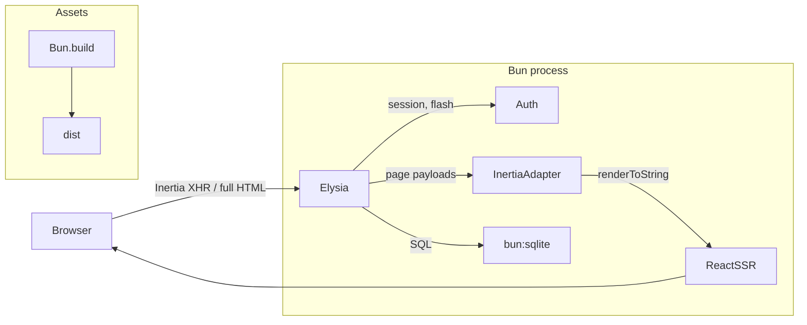

# Elysia + Inertia v3 Boilerplate

A production-shaped, full-stack boilerplate: **Elysia** (HTTP) + **bun:sqlite**
(database) + **Inertia v3 / React 19** (server-driven UI with in-process SSR),
running entirely on **Bun**. Auth (register / login / dashboard / logout) is
wired end to end and verified.



## Quick start

```bash
bun install
cp .env.example .env
bun run dev          # http://localhost:3000
```

- **Register** — create an account, lands on the dashboard
- **Login / Logout** — session cookie, argon2id passwords
- `bun run db:seed` — demo user `demo@example.com` / `password123`

### Scripts

| Command             | What it does                                              |
| ------------------- | --------------------------------------------------------- |
| `bun run dev`       | Watch mode; rebuilds client assets on restart             |
| `bun run build`     | Prebuild client assets → `dist/` (+ `manifest.json`)      |
| `bun run start`     | Serve prebuilt assets (`NODE_ENV=production`)             |
| `bun run db:seed`   | Create a demo user (`[email] [password]` args supported)  |
| `bun run typecheck` | `tsc --noEmit`                                            |

## Architecture

```
src/
├── index.ts                # entry: build assets (dev), load manifest, listen
├── server/
│   ├── app.ts              # composition + global error handling (422/404/500)
│   ├── db.ts               # bun:sqlite: schema, prepared statements
│   ├── auth.ts             # argon2id, sessions, flash, cookies, guards
│   ├── inertia.ts          # Inertia v3 server adapter (SSR shell, XHR, 409)
│   ├── inertia-plugin.ts   # store declarations + per-request session resolve
│   ├── assets.ts           # Bun.build pipeline + manifest + static serving
│   ├── security.ts         # CSRF origin check (SameSite=Lax + Origin)
│   └── routes/
│       ├── auth.routes.ts  # POST /register /login /logout (+ TypeBox schemas)
│       └── pages.routes.ts # GET / /login /register /dashboard
├── client/
│   ├── app.tsx             # Inertia client bootstrap (hydrate or render)
│   ├── ssr.tsx             # in-process SSR renderer (react-dom/server)
│   ├── pages.ts            # explicit page registry (shared by SSR + bundle)
│   ├── pages/              # Login, Register, Dashboard, NotFound
│   ├── components/         # Layout, AuthLayout, Field
│   └── styles.css          # plain CSS, light/dark
├── shared/
│   ├── types.ts            # User, FlashData, SharedPageProps, DashboardStats
│   └── inertia.d.ts        # InertiaConfig augmentation → typed props.auth
└── scripts/                # build.ts, seed.ts
```

## How the pieces fit

- **Inertia v3 wire protocol** (`src/server/inertia.ts`): full HTML with SSR
  markup + `data-page` JSON for browser visits; JSON page payloads for
  `X-Inertia` requests; `409 + X-Inertia-Location` on asset-version mismatch;
  partial reloads via `X-Inertia-Partial-*`; one-shot **flash** and shared
  props (`auth.user`) merged into every page. No separate SSR server process —
  pages render in-process with `react-dom/server`.
- **SSR + hydration**: `renderPage()` renders the page tree with
  `createInertiaApp({ page, render: renderToString })`; the client entry
  hydrates when `data-server-rendered` is present, otherwise client-renders.
- **Asset versioning**: `Bun.build` emits content-hashed files; the hash is
  the Inertia `version`. On deploy, stale clients get a 409 and reload.
- **Auth**: argon2id (via `Bun.password`), 256-bit random session tokens in
  SQLite, httpOnly `SameSite=Lax` cookies, 30-day expiry, lazy expiry cleanup.
  Flash messages live on the session row and are consumed on render.
- **CSRF**: `SameSite=Lax` + Origin check on unsafe methods.
- **Validation**: TypeBox schemas at the route level; `onError` maps failures
  to 422 Inertia page payloads with per-field messages
  (`VALIDATION_MESSAGES` in `routes/auth.routes.ts`).

## Notes / decisions

- **Plugin hooks**: Elysia 1.4 applies hooks in registration order and drops
  hooks/derive from plugins that carry no routes — that's why `app.ts`
  registers `checkOrigin`/`onError` before routes, and why the session resolve
  hook lives on the route-bearing instances (`makePopulateStore`).
- `import.meta.glob` was removed from Bun 1.3 — the page registry uses
  explicit imports instead (also nicer for type checking).
- Extend pages by adding a file in `src/client/pages/` **and** an entry in
  `src/client/pages.ts`.
- Want Vue/Svelte instead of React? Swap `@inertiajs/react` for the
  corresponding v3 adapter and update `app.tsx`/`ssr.tsx` — the server side
  is adapter-agnostic.
