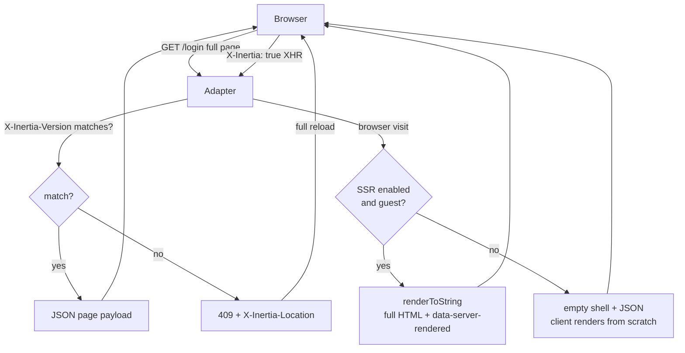
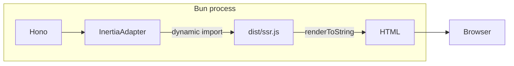

Dulak uses [Inertia v3](https://inertiajs.com/) to build a single-page app
without writing an API. The server renders full HTML on first visit, then
the client takes over for SPA navigation — no JSON endpoints to maintain,
no client-side router to wire.

The adapter lives in `src/server/inertia.ts` (~270 lines, zero
dependencies beyond `@inertiajs/core` types). It implements the v3 wire
protocol: full HTML for browser visits, JSON for XHR navigation, 409 on
asset version mismatch, and partial reloads.

## Request flow



### Browser visit (full page)

The adapter builds the Inertia `Page` object (component name, props, URL,
version, flash), then renders it server-side via `renderPage()` from
`dist/ssr.js`. The HTML shell includes:

- `<script data-page="app" type="application/json" nonce="...">` — the
  page payload, escaped and nonce-tagged for strict CSP.
- `<div data-server-rendered="true" id="app">` — the rendered component
  HTML. The client reads this attribute to decide hydrate vs. plain render.
- `<script type="module" src="/assets/app-HASH.js">` — the client bundle.
- Inline theme boot script (nonce-tagged) to prevent FOUC.

### XHR navigation (SPA)

When the Inertia client navigates (clicking a link or calling
`router.visit()`), it sends `X-Inertia: true` with the current asset
version. The adapter responds with a JSON page payload and
`X-Inertia-Version` header — no HTML, no shell. The client swaps the
component and updates props without a full page reload.

### 409: asset version mismatch

When the client's `X-Inertia-Version` doesn't match the server's current
asset version (the client loaded an older bundle), the adapter returns
`409 Conflict` with `X-Inertia-Location`. The client does a full page
reload to pick up the new assets. This is the Inertia protocol's
cache-busting mechanism — see [Asset versioning](#asset-versioning)
below.

## SSR: in-process, not a sidecar



There is no separate SSR server. `ssr.ts` (or `ssr.tsx` on React) is
bundled by `Bun.build` into `dist/ssr.js` with the framework's server
renderer (`react-dom/server`, `svelte/server`, `@vue/server-renderer`).
The adapter loads it via a dynamic import — not a static import — because
the bundle doesn't exist on a fresh clone until `buildClientAssets()` runs.

### SSR skip for authenticated routes

SSR provides zero value behind an auth wall — no SEO, and the client
hydrates and replaces server HTML anyway. When `SSR=true` and the user is
authenticated, the adapter ships an empty shell + JSON payload instead of
rendering server-side. This cuts server CPU and memory on the routes that
benefit least from SSR.

Set `SSR=false` to disable SSR entirely — every page ships an empty shell
and the client renders from scratch (faster boot, no `react-dom/server`
cost).

### Svelte/Vue: dynamic import to `dist/ssr.js`

On Svelte and Vue templates, the adapter imports `../../dist/ssr.js`
(the bundled output), not `../client/ssr` (the source). Bun's runtime
cannot resolve `@inertiajs/svelte` or `@inertiajs/vue3` from source
because those packages only export under the `svelte` / `vue` condition,
which `Bun.build` resolves via its plugin but the runtime cannot. The
bundle inlines the compiled server renderer and loads cleanly.

On React templates, a static import works because `@inertiajs/react`
exports without a special condition.

## The page payload

Every response — HTML or JSON — carries the same `Page` object:

```ts
{
  component: "Login",           // which page component to render
  props: {                      // merged: route props + shared props
    googleEnabled: true,        //   route-specific
    auth: { user: null },       //   shared (always present)
    errors: {},                 //   shared (validation errors)
    ...flash,                   //   one-shot (success, error messages)
  },
  url: "/login",                // current URL (scheme from APP_URL)
  version: "a1b2c3d4",          // asset hash (Inertia version negotiation)
  flash: { success: "..." },    // one-shot, consumed on render
}
```

### Shared props

`auth.user` and `errors` are merged into every page by the adapter —
routes don't pass them manually. `auth.user` is `null` for guests, or the
`PublicUser` object (never includes `passwordHash`, `googleId`, or
`emailVerified` internals) for authenticated users.

### Flash messages

Flash is one-shot: stored on the session row, read once during render,
then cleared. Routes set flash via `setFlash(token, { success: "..." })`
before redirecting. The adapter consumes it in `page()` and calls
`clearFlash()` after building the response — so a refresh never shows the
same flash twice.

### Partial reloads

The Inertia client can request only a subset of props via
`X-Inertia-Partial-Component` + `X-Inertia-Partial-Data` (or
`X-Inertia-Partial-Except`). The adapter filters props server-side so
only the requested keys are returned — useful for refreshing a list
without re-fetching the entire page state.

## Asset versioning

`Bun.build` emits content-hashed filenames (`app-a1b2c3d4.js`). The hash
becomes the Inertia `version` — stored in `manifest.json` and loaded at
startup. When the client's version doesn't match (assets were rebuilt and
the client is stale), the adapter returns `409` and the client reloads.

This means: rebuild assets → the version changes → every connected client
gets a 409 on its next navigation and reloads to pick up the new bundle.
No manual cache-busting, no deploy coordination.

## CSP nonce

Each request generates a random 16-byte nonce (base64) in
`inertiaMiddleware`. The nonce is embedded in:

- Inline `<script>` tags (theme boot, page payload) — `script-src 'nonce-...'`
- Inline `<style>` (Inertia progress bar) — `style-src 'nonce-...'`
- `<meta name="csp-nonce">` — so the client-side Inertia can read it for
  its own inline styles

This allows a strict CSP without `'unsafe-inline'`. See
[Request lifecycle](/architecture/request-lifecycle/) for where CSP is
set in the middleware chain.

## URL scheme behind a reverse proxy

Behind a TLS-terminating proxy (Cloudflare Flexible), the origin
connection is HTTP so `request.url` is `http://`. The adapter takes the
scheme from `APP_URL` (set by the operator) and keeps the host from the
actual request — so redirects and Inertia URLs match what the browser
sees, while supporting multi-domain setups.

## The middleware

`inertiaMiddleware` (`src/server/inertia-middleware.ts`) runs for every
request — including unmatched routes — and populates the Hono context
variables:

| Variable | Type | Source |
| --- | --- | --- |
| `user` | `User \| null` | Session cookie → `resolveUser()` |
| `flash` | `FlashData` | Session row → `readFlash()` |
| `sessionToken` | `string \| null` | Cookie value |
| `inertia` | `Inertia` | New instance per request |
| `cspNonce` | `string` | `randomBytes(16)` |
| `requestId` | `string` | `requestLogger` (earlier in chain) |

Routes access these via `c.var.inertia.render(...)`, `c.var.user`, etc.
The `notFound` and `onError` handlers also rely on `c.var.inertia` being
set — that's why the middleware runs for every request, not just matched
routes.
